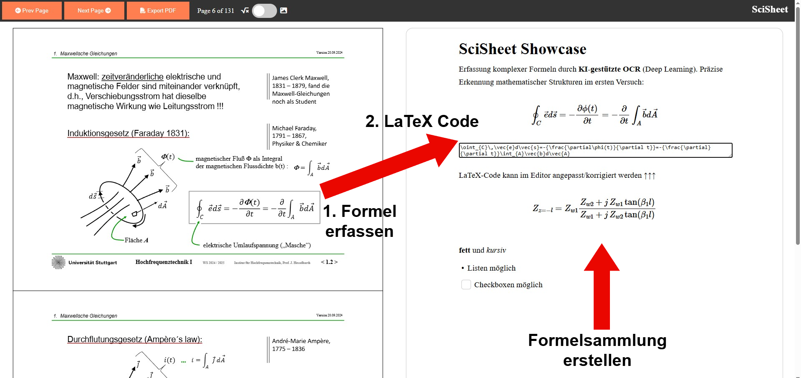

# SciSheet🚀

**SciSheet** ist ein Tool zur intelligenten Erfassung mathematischer Formeln aus Dokumenten. Es wandelt Bildschirminhalte (z. B. aus Vorlesungsskripten, Paper, PDFs, ..) direkt in editierbaren LaTeX-Code um und ermöglicht so den schnellen Aufbau digitaler Formelsammlungen.

> [!WARNING]
> **Projektstatus:** Dies ist ein **Prototyp** (Proof of Concept).

## Features
* **KI-gestützte OCR:** Präzise Erkennung komplexer mathematischer Strukturen (Brüche, Integrale, ...).
* **Direkte LaTeX-Ausgabe:** Erzeugt sofortigen Code, der direkt in Editoren wie Overleaf oder TeXstudio verwendet werden kann.
* **Lokal & Sicher:** Die gesamte Formelerkennung läuft lokal auf deinem Rechner. Es werden keine Daten an externe Cloud-Dienste gesendet.
* **Einfache Bearbeitung:** Der generierte Code kann direkt im integrierten Editor angepasst werden.

## Technische Basis
Der Kern der Formelerkennung basiert auf dem Open-Source-Modell von:
🔗 **Lukas Blecher:** [LaTeX-OCR](https://lukas-blecher.github.io/LaTeX-OCR/)

## Installation & Setup

Folge diesen Schritten, um SciSheet lokal zu starten:

1. installiere venv
2. aktiviere venv
3. installiere alle requirements
4. python app.py
5. Starte Live Server von index.html (VSC Extension)

## Bekannte Probleme (Known Issues)
PDF-Export: Die Funktion zum Exportieren der fertigen Sammlung als PDF befindet sich noch in der Entwicklung. Aktuell kann es zu Formatierungsproblemen kommen.